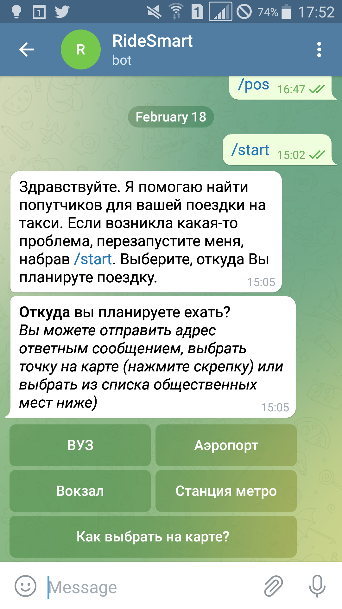

# Ride-sharing bot for Moscow

  
   

## What is it?

This is a ride-sharing bot for Telegram. If you live in Moscow, Russia, you're in luck, because the [bot](https://t.me/RideSmart_bot) is already operational and you can share your taxi rides with other people planning to take a similar trip at more or less the same time. If you are a frequent taxi rider, this [bot](https://t.me/RideSmart_bot) might save you some money.

## If you are in Moscow
Just click this [link](https://t.me/RideSmart_bot) or search in the Telegram app for RideSmart (@RideSmart_bot), type `/start`, and start sharing your rides.

## If you are elsewhere, but want to make ride sharing available in your area

You'll need to change hop-on/hop-off location in `bot4.py` and host the modified bot on your machine.

1. Create a bot on [Telegram](https://telegram.org/). To do that, download the Telegram app, go to [@BotFather](https://telegram.me/BotFather) and copy your bot API token into `bot4.py`.
2. Create a free account on [MongoDB](https://www.mongodb.com/) and a database, get the API key and paste it into `bot4.py`. Make sure you white list your DB client's IP address.
3. Edit the hop-on/hop-off locations in `bot4.py` for your area.
4. Run the bot backend `bot4.py`. For the bot to be available at all times, it is best to host the bot on a cloud VM like [PythonAnywhere](https://pythonanywhere.com) or similar.

## Features

- Hop-on/hop-off locations include over 280 metro stations, railway stations, airports and major universities (yes, this should be good for students).
- Hop-on/hop-off locations can be picked from the list or using a pin on Telegram's built-in map.

  

## Telegram commands
- `/start` - starts the bot (only needs to be run once)

## Dependencies

`pip install pymongo==3.10.1 jupyter==1.0.0 numpy==1.20.3 pandas==1.2.4 python-telegram-bot==13.6 requests==2.25.1 beautifulsoup4==4.7.1`

## Development

Want to contribute? Great!

## License

**Free Software, Hell Yeah!**
